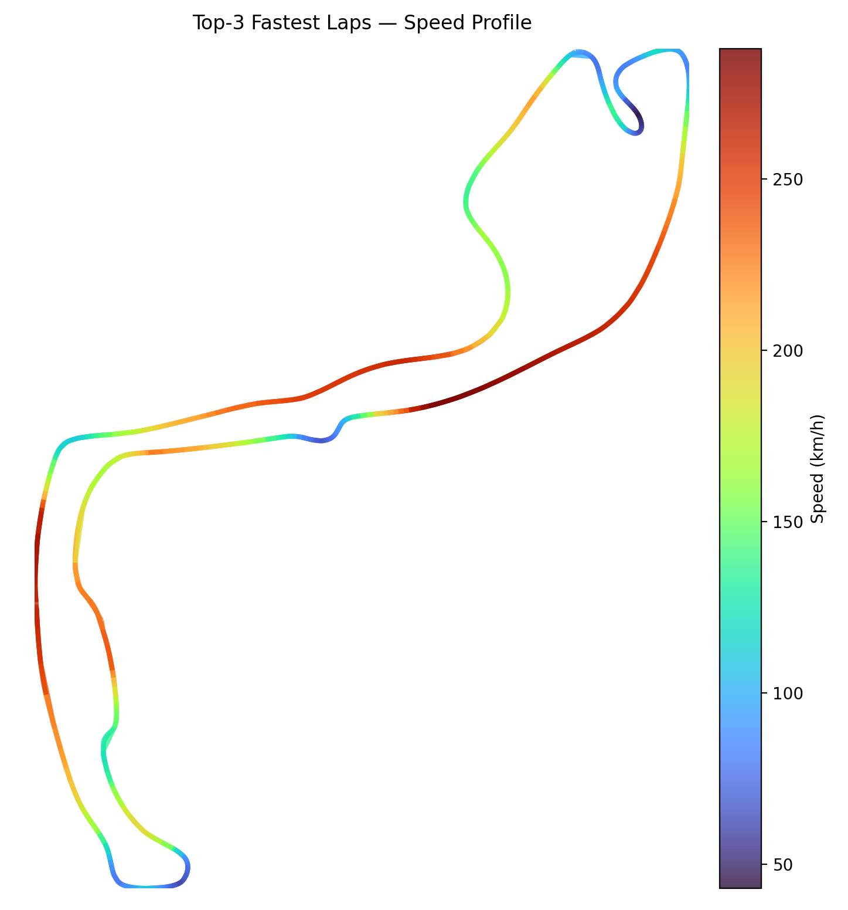

# F1 Race Results Predictor

I’m building a Formula 1 race predictor 🏎️ that pulls in historical data with FastF1, cleans and normalizes results, and updates driver rankings after every Grand Prix to forecast finishing orders. It’s a work in progress, and I’m constantly adding new features and improvements! 🚀

---

## Key Points

* **Data ingestion:** Pulls 2018–2024 race results via FastF1 API
* **Data cleaning:** Filters DNFs and standardizes finishing positions
* **Elo engine:** Initializes all drivers at 1500, updates after each GP, configurable K-factors for Sprint/Feature races
* **Performance:** Delivers \~10% accuracy gain over last season’s standings baseline
* **Track Heatmap** 

---

## Roadmap (WIP)

* Integrate qualifying session ratings
* Build an interactive dashboard (Streamlit or React)

---

## Future Work

* Refine K-factor dynamics based on track characteristics
* Incorporate weather data to adjust prediction confidence
* Add live API endpoint for real-time race forecasts
* Improve accuracy (by a lot)

---
## Connect

* 🌐 Website: \[https://sites.google.com/psu.edu/]
* 🔗 LinkedIn: \[https://www.linkedin.com/in/meeravshah/]
